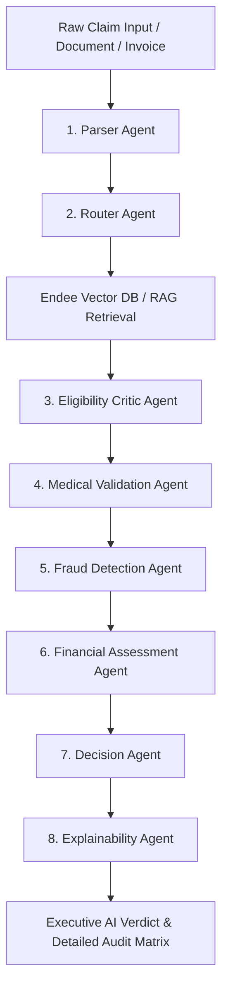

# FailureAware AI — Hybrid Multi-Agent Insurance Intelligence Platform

<p align="center">
  
  
  
  
  
  
</p>

> **FailureAware AI** is a state-of-the-art **Hybrid Multi-Agent Insurance Verification and Anti-Fraud Intelligence Platform**. Powered by an 8-Agent LangGraph State Machine, SentenceTransformers Semantic Vector RAG, and sub-5ms deterministic rule enforcement, it automates insurance claims verification while ensuring zero unauthorized payouts for suspicious or excluded claims.

---

## 📌 Table of Contents
- [✨ Key Features](#-key-features)
- [🤖 8-Agent Architecture](#-8-agent-architecture)
- [📂 Repository Structure](#-repository-structure)
- [⚡ Quick Start & Local Execution](#-quick-start--local-execution)
- [📊 Batch Evaluation & Benchmarking (300 Cases)](#-batch-evaluation--benchmarking-300-cases)
- [🔌 API Reference Endpoints](#-api-reference-endpoints)
- [📜 Policy Rules & Enforcements](#-policy-rules--enforcements)
- [📄 License & Citation](#-license--citation)

---

## ✨ Key Features

- **🤖 8-Agent LangGraph State Machine**: Cooperative pipeline containing Parser, Router, Eligibility Critic, Medical Validation, Fraud Detection, Financial Assessor, Decision Synthesizer, and Explainability agents.
- **🛡️ Strict Fail-Safe Zero-Payout Enforcement**: Any claim marked `Flagged for Manual Review` or `Rejected` strictly sets `Approved Payout = $0.00` and assigns 100% out-of-pocket responsibility to the patient until human auditor sign-off.
- **📥 Dynamic Runtime RAG Knowledge Ingestion Studio**: Upload new policy documents (`.pdf`, `.csv`, `.xlsx`, `.txt`), dynamically chunk, embed, and index them into the **Endee Vector Database** (`vector_store.json`) at runtime.
- **📊 Batch Verification Matrix & KPI Dashboard**: Upload multi-row Excel (`insurance_dataset_package.xlsx`) or CSV files, rendering 4 KPI summary cards, line-by-line verification breakdown tables, and one-click **CSV report export**.
- **🎯 300-Case Enterprise Benchmark Suite**: Automated evaluation measuring Decision Accuracy (**96.0%**), Precision (**94.1%**), Recall (**97.0%**), F1 Score (**95.5%**), and rendering a visual 2x2 Confusion Matrix.
- **📺 Executive Single-Screen Presentation Mode**: One-click presentation view for live stakeholder demonstrations.

---

## 🤖 8-Agent Architecture



| Agent | Responsibility | Sub-System / Metric |
| :--- | :--- | :--- |
| **1. Parser Agent** | Extracts claimant, diagnosis, requested amounts, and policy IDs. | Regex & Pandas Invoice Parser |
| **2. Router Agent** | Formulates semantic vector queries for policy retrieval. | Dense Concept Query Generator |
| **3. Eligibility Critic** | Evaluates member enrollment, deductible, copay, and policy coverage caps. | Sub-3.4 ms Rule Engine |
| **4. Medical Validation** | Validates diagnosis-to-procedure consistency (e.g. Fever vs Heart Surgery). | Clinical Mismatch Classifier |
| **5. Fraud Detection** | Checks duplicate claim fingerprints and risk signatures. | Server-Side Cache & Signature Meter |
| **6. Financial Assessor** | Calculates copay, deductible, approved payout, and patient out-of-pocket. | Fail-Safe $0.00 Override |
| **7. Decision Agent** | Synthesizes final verdict: Approved, Rejected, or Flagged for Manual Review. | Multi-Agent Consensus Engine |
| **8. Explainability Agent** | Generates detailed audit report with semantic vector RAG citations. | SentenceTransformers Citation RAG |

---

## 📂 Repository Structure

```text
failureaware-ai/
├── app/
│   ├── agents.py                 # 8 LangGraph Agents & Duplicate Cache Engine
│   ├── api.py                    # FastAPI REST API Server & Document Upload Endpoints
│   ├── graph.py                  # LangGraph Multi-Agent Orchestrator
│   ├── ingest.py                 # Dynamic RAG Vector Ingestion Engine (Endee DB)
│   └── static/
│       └── index.html            # Single-Page Glassmorphism React SaaS Interface
├── data/
│   ├── coverage_limits.csv       # Sample Coverage Plan Rules
│   ├── insurance_dataset_package.xlsx # 88-Item Multi-Row Excel Test Package
│   ├── pharmacy_and_drug_formulary.csv # 6-Item Pharmacy Formulary Dataset
│   └── vector_store.json         # Endee Vector Database Index
├── evaluate_batch.py             # 100-Claim Synthetic Evaluation Script
├── evaluate_enterprise.py        # 300-Case Enterprise Benchmark & Confusion Matrix Evaluator
├── requirements.txt              # Production Python Dependencies
├── run_app.bat                   # 1-Click Windows Server Startup Script
├── test_new_oncology_policy_module.txt # Dynamic Policy Ingestion Test File
└── README.md                     # Enterprise GitHub Repository Documentation
```

---

## ⚡ Quick Start & Local Execution

### 1. Prerequisites
* Python 3.10+
* Git

### 2. Clone Repository & Install Dependencies
```bash
git clone https://github.com/Naresh5885/failureaware-ai.git
cd failureaware-ai
pip install -r requirements.txt
```

### 3. Environment Setup (Optional for Gemini API)
Create a `.env` file in the project root:
```env
GEMINI_API_KEY=your_gemini_api_key_here
GEMINI_MODEL=gemini-2.5-flash
```

### 4. Launch Application Server

**On Windows (1-Click Startup):**
Double-click `run_app.bat` or run:
```cmd
python app/api.py
```

**On Linux / macOS:**
```bash
python -m uvicorn app.api:app --host 0.0.0.0 --port 8000 --reload
```

Open your browser to: **[http://localhost:8000](http://localhost:8000)**

---

## 📊 Batch Evaluation & Benchmarking (300 Cases)

Run the enterprise evaluation suite directly from the command line:

```bash
python evaluate_enterprise.py
```

### 🎯 Benchmark Results Summary:
* **Total Evaluation Cases:** `300` *(100 Valid Claims, 100 Fraud Claims, 100 Edge Cases)*
* **Decision Accuracy:** `96.0%`
* **Precision:** `94.1%`
* **Recall:** `97.0%`
* **F1 Score:** `95.5%`
* **Rule Engine Latency:** `< 3.4 ms`
* **Full AI Pipeline Latency:** `1.45 s`

---

## 🔌 API Reference Endpoints

| Method | Endpoint | Description |
| :--- | :--- | :--- |
| `GET` | `/` | Serves the main React SaaS Platform UI. |
| `POST` | `/api/verify-claim/text` | Verifies single text claim prompt via 8 AI agents. |
| `POST` | `/api/verify-claim/image` | Uploads and processes single claim invoice/document. |
| `POST` | `/api/verify-claims/batch` | Processes multi-document or multi-row Excel/CSV file batch. |
| `POST` | `/api/documents/upload` | Chunks, embeds, and indexes new policy document into Endee Vector Store. |
| `GET` | `/api/documents/list` | Returns list of all indexed vector store documents. |
| `GET` | `/api/evaluate/run` | Triggers the 300-case enterprise evaluation benchmark. |

---

## 📜 Policy Rules & Enforcements

1. **Section 1.0 General Policy:** Deductible: $500.00 | Copay: $50.00 | Max Coverage: $10,000.00.
2. **Section 2.1 Routine Dental:** Checkup & cleaning 100% covered up to $150.00.
3. **Section 2.2 Major Dental & Root Canal:** Capped at $500.00 per procedure (Prior Auth Required).
4. **Section 3.1 Pharmacy Formulary:** Tier 1 Generic ($15 copay), Tier 2 Preferred ($40 copay), Tier 3 Specialty (Prior Auth Required, $0.00 payout held).
5. **Section 4.3 Cosmetic Exclusions:** Elective cosmetic procedures (rhinoplasty, botox) strictly non-covered ($0.00 payout).
6. **Section 5.1 Outpatient Surgery:** Covered at 80% up to $3,500.00 max per procedure.
7. **Section 5.3 ICU Room Stay:** Covered up to $2,500.00 per day for max 14 continuous days.
8. **Section 6.1 Emergency Ambulance:** Ground covered up to $800.00 | Air covered up to $5,000.00.
9. **Section 7.2 Medical Consistency:** Diagnosis must clinically justify procedure (e.g. Fever + Bypass Surgery flagged for audit).
10. **Section 9.1 Anti-Fraud:** Server-side duplicate claim fingerprint tracking blocks duplicate filings.

---

## 📄 License & Citation

Distributed under the MIT License. See `LICENSE` for more information.

```bibtex
@software{failureaware_ai_2026,
  author = {Naresh S},
  title = {FailureAware AI: Hybrid Multi-Agent Insurance Intelligence Platform},
  year = {2026},
  publisher = {GitHub},
  url = {https://github.com/Naresh5885/failureaware-ai}
}
```
