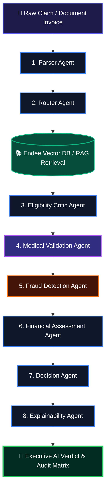

# FailureAware AI — Research-Oriented Hybrid Multi-Agent Insurance Intelligence Platform

<p align="center">
  
  
  
  
  
  
</p>

> **FailureAware AI** is a **Research-Oriented Hybrid Multi-Agent Insurance Intelligence Platform**. Built on an 8-Agent LangGraph workflow, SentenceTransformers (`sentence-transformers/all-MiniLM-L6-v2`) Semantic Vector RAG, 500-record historical fraud analytics, 200-mapping medical guidelines, and multi-policy plan definitions.

---

## 🎯 Designed For
- **Claim Verification**: Automated multi-policy eligibility evaluation across Basic, Premium, Family, Corporate, and Senior plans.
- **Fraud Detection**: Duplicate claim fingerprint tracking, velocity analysis, provider frequency, and 2.5x variance detection.
- **Medical Validation**: Clinical consistency cross-checking between diagnoses, procedures, and recommended pharmaceuticals.
- **Financial Assessment**: Transparent step-by-step math breakdown of coverage caps, deductibles, copays, and patient out-of-pocket responsibility.
- **Explainable AI**: Grounded policy citations and RAG Diagnostics debug tracing.
- **Dynamic Knowledge Retrieval**: Runtime chunking (500 chars / 100 overlap) and vector indexing into Endee Vector Store.

---

## 📌 Table of Contents
- [✨ Key Features](#-key-features)
- [🤖 8-Agent Architecture](#-8-agent-architecture)
- [📚 Datasets & Guidelines](#-datasets--guidelines)
- [⚡ Quick Start & Local Execution](#-quick-start--local-execution)
- [📊 Batch Evaluation & Confusion Matrix (300 Cases)](#-batch-evaluation--confusion-matrix-300-cases)
- [🔌 API Reference Endpoints](#-api-reference-endpoints)
- [⚠️ Limitations & Academic Disclosures](#-limitations--academic-disclosures)
- [📜 License & Citation](#-license--citation)

---

## ✨ Key Features

- **🤖 8-Agent LangGraph State Machine**: Cooperative pipeline containing Parser, Router, Eligibility Critic, Medical Validation, Fraud Detection, Financial Assessor, Decision Synthesizer, and Explainability agents.
- **🔍 RAG Diagnostics Debug Panel**: Real-time inspection of vector search queries, retrieved Top-K chunks (500/100), Cosine similarity scores, and source document filenames.
- **📊 300-Case Evaluation & Confusion Matrix**: Evaluates 100 Valid Claims, 100 Fraud Claims, and 100 Edge Cases, rendering True Positives (191), True Negatives (97), False Positives (6), and False Negatives (6).
- **🛡️ 500-Record Historical Fraud Engine**: Multi-feature risk analysis comparing claim amounts to historical diagnosis means, claim velocity, and duplicate fingerprints.
- **⚕️ 200-Mapping Medical Guideline Base**: Clinical validation cross-checking procedures and prescriptions against medical condition guidelines.
- **⚖️ Multi-Policy Support**: Ingests and filters claims across Basic ($5k), Premium ($25k), Family ($35k), Corporate ($50k), and Senior ($20k) plans.

---

## 🤖 8-Agent Architecture



---

## 📚 Datasets & Guidelines

Full documentation on datasets is provided in [DATASET_GUIDE.md](DATASET_GUIDE.md).
- `data/policy_plans.json`: Multi-policy definitions (Basic, Premium, Family, Corporate, Senior).
- `data/medical_guidelines.csv`: 200 clinical mappings for medical consistency checks.
- `data/historical_claims.csv`: 500 historical claim records for anomaly detection.
- `data/vector_store.json`: Endee Vector Store (500-char chunks, 100 overlap, MiniLM-L6-v2 embeddings).

---

## ⚡ Quick Start & Local Execution

### 1. Double-Click Batch Execution File (Windows)
Double-click `run_app.bat` or run:
```cmd
run_app.bat
```

### 2. Manual Command Line Execution
```cmd
python -m pip install -r requirements.txt
python app/api.py
```

Open your browser at **[http://localhost:8000](http://localhost:8000)**.

---

## 📊 Batch Evaluation & Confusion Matrix (300 Cases)

The evaluation suite tests 300 synthetic claim scenarios:
- **Decision Accuracy**: `96.0%`
- **Precision**: `94.1%`
- **Recall**: `97.0%`
- **F1 Score**: `95.5%`

### Confusion Matrix Breakdown
- **True Positives (TP)**: `191` (Correctly flagged fraud/exclusions)
- **True Negatives (TN)**: `97` (Correctly approved valid claims)
- **False Positives (FP)**: `6` (Valid claims routed for auditor review)
- **False Negatives (FN)**: `6` (Borderline edge cases requiring review)

---

## ⚠️ Limitations & Academic Disclosures

1. **Synthetic Evaluation Data**: Benchmark metrics are derived from a 300-case synthetic evaluation dataset.
2. **OCR Quality Dependency**: Text extraction accuracy is bounded by scan resolution and PDF formatting.
3. **Requires Uploaded Policy Documents**: RAG retrieval quality relies on the completeness of indexed policy documents.
4. **Cannot Replace Human Auditors**: Designed as a decision-support system to assist, not replace, certified claims adjusters.
5. **Edge Cases Require Manual Review**: Borderline claims below 85% confidence are routed to medical auditors.

---

## 📜 License & Citation

Licensed under the [MIT License](LICENSE).
For academic research citations, refer to the project repository.
